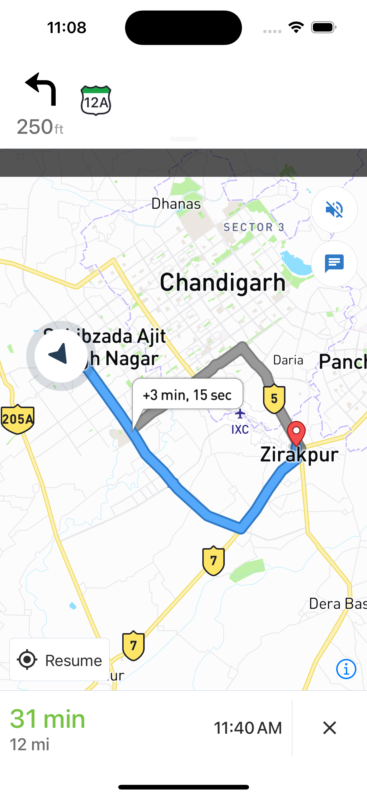
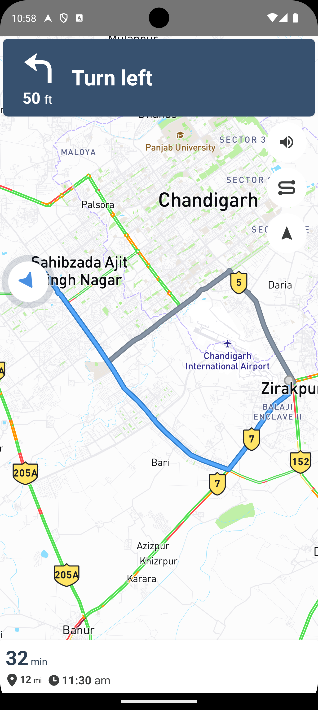
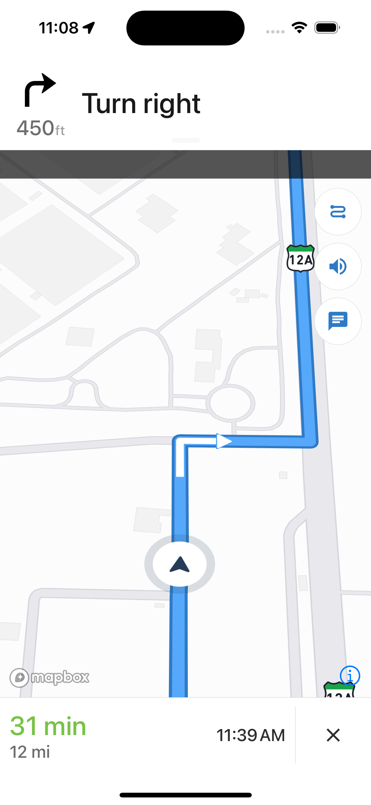
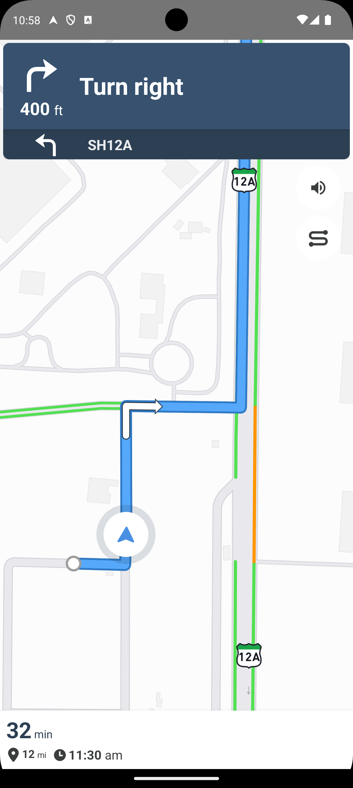

# @pawan-pk/react-native-mapbox-navigation <br/>[](https://www.npmjs.com/package/@pawan-pk/react-native-mapbox-navigation) [](https://github.com/pawan-pk/react-native-mapbox-navigation/actions) [](https://www.npmjs.com/package/@pawan-pk/react-native-mapbox-navigation)

Mapbox React Native SDKs enable interactive maps and real-time, traffic-aware turn-by-turn navigation, dynamically adjusting routes to avoid congestion.

🆕&nbsp; Uses Mapbox navigation v3 SDK<br>
📱&nbsp; Supports iOS, Android<br>
🌍&nbsp; Various languages<br>
🎨&nbsp; Customizable<br>
⛕&nbsp; Multiple Waypoints<br>
🚘&nbsp; iOS CarPlay Support

<a href="https://www.buymeacoffee.com/pawan_kumar" target="_blank"></a>

## Route View

<table>
   <tr>
  <td></td>
        <td>
    </td>
  </tr>
      <tr>
  <td align="center">iOS</td><td align="center">Android</td>
  </tr>
  </table>

## Turn by turn Navigation View

<table>
   <tr>
  <td></td>
        <td>
    </td>
  </tr>
      <tr>
  <td align="center">iOS</td><td align="center">Android</td>
  </tr>
  </table>

## Installation

### 1. Download package

```sh
# yarn
yarn add @pawan-pk/react-native-mapbox-navigation

# npm
npm install @pawan-pk/react-native-mapbox-navigation
```

## iOS Specific Instructions

1. Place your secret token in a `.netrc` file located in your operating system's root directory. Ensure that the current user has `Read` and `Write` privileges. For more details, refer to the [documentation](https://docs.mapbox.com/ios/navigation/guides/).

   ```text
   ~/.netrc

    machine api.mapbox.com
    login mapbox
    password <INSERT SECRET ACCESS TOKEN>
   ```

2. Install pods to add the native `RNMapboxNavigation` to your project:

   ```base
   cd ios && pod install
   ```

3. Add `MapboxNavigation SDK` to your project:

   1. Open your Xcode project or workspace, then go to `File > Add Package Dependencies...`.
   2. Enter `https://github.com/mapbox/mapbox-navigation-ios.git` as the URL and press `Enter` to pull in the package.
   3. Set **Dependency Rule** to **Up to Next Major Version** and enter `3.5.0` as the minimum version. **Click Add Package**.
   4. In the **Choose Package Products for mapbox-navigation-ios.git** modal, select your project's name in the **Add to Target** column for both `MapboxNavigationCore` and `MapboxNavigationUIKit`. Click **Add Package**

4. Place your public token in your Xcode project's `Info.plist` and add a `MBXAccessToken` key whose value is your public access token.

   ```xml
    <key>MBXAccessToken</key>
    <string>your-mapbox-token</string>
   ```

5. Add the `UIBackgroundModes` key to `Info.plist` with `audio` and `location` if it is not already present. This will allow your app to deliver audible instructions while it is in the background or the device is locked.

   ```xml
   <key>UIBackgroundModes</key>
   <array>
     <string>audio</string>
     <string>location</string>
   </array>
   ```

   For more details installation you can read the [Official docs of Mapbox](https://docs.mapbox.com/ios/navigation/guides/).

## Android Specific Instructions

1. Place your secret token in your android app's top level `gradle.properties` or `«USER_HOME»/.gradle/gradle.properties` file

   ```
   MAPBOX_DOWNLOADS_TOKEN=<YOUR_MAPBOX_DOWNLOADS_TOKEN>
   ```

2. Open up your _project-level_ `build.gradle` file. Declare the Mapbox Downloads API's `releases/maven` endpoint in the _allprojects_ `repositories` block.

   ```gradle
   allprojects {
       repositories {
           maven {
                 url 'https://api.mapbox.com/downloads/v2/releases/maven'
                 authentication {
                     basic(BasicAuthentication)
                 }
                 credentials {
                   // Do not change the username below.
                   // This should always be `mapbox` (not your username).
                     username = "mapbox"
                     // Use the secret token you stored in gradle.properties as the password
                     password = project.properties['MAPBOX_DOWNLOADS_TOKEN'] ?: ""
                 }
             }
       }
   }
   ```

3. Add Resources<br/>
   To do so create a new string resource file in your app module `(e.g. app/src/main/res/values/mapbox_access_token.xml)` with your public Mapbox API token:

   ```xml
   <?xml version="1.0" encoding="utf-8"?>
    <resources xmlns:tools="http://schemas.android.com/tools">
        <string name="mapbox_access_token" translatable="false" tools:ignore="UnusedResources">YOUR_MAPBOX_ACCESS_TOKEN</string>
    </resources>
   ```

   For more details installation you can read the [Official docs of Mapbox](https://docs.mapbox.com/android/navigation/guides/installation).

## Usage

```js
import MapboxNavigation from '@pawan-pk/react-native-mapbox-navigation';
import { StyleSheet } from 'react-native';

export default function App() {
  return (
    <MapboxNavigation
      startOrigin={{ latitude: 30.699239, longitude: 76.6905161 }}
      destination={{ latitude: 30.6590196, longitude: 76.8185852 }}
      waypoints={[
        { latitude: 30.726848, longitude: 76.733758 },
        { latitude: 30.738819, longitude: 76.757902 },
      ]}
      style={styles.container}
      shouldSimulateRoute={false}
      showCancelButton={false}
      language="en"
    />
  );
}

const styles = StyleSheet.create({
  container: {
    flex: 1,
  },
});
```

## `MapboxNavigation` Props

| Parameter                 | Type                            | Default          | Description                                                                                | Platform     |
| ------------------------- | ------------------------------- | ---------------- | ------------------------------------------------------------------------------------------ | ------------ |
| `startOrigin` (Required)  | `Coordinate`                    |                  | The starting point of the navigation used to fetch route.                                  | All          |
| `destination` (Required)  | `Coordinate & {title?: string}` |                  | The destination point of the navigation. Title used for instructions, and events callback. | All          |
| `profile`                 | `RouteProfile`                  | `driving`        | The reoute profile mode to fetch route directions.                                         | All          |
| `mapStyle`                | `MapboxMapStyle`                | `navigation-day` | The map style use to show map layer type.                                                  | All          |
| `customStyle`             | `string`                        |                  | Set custom style json to customise map view style                                          | All          |
| `mute`                    | `boolean`                       | `false`          | Set voice instructions enable or disable.                                                  | All          |
| `waypoints`               | `Array<Waypoint>`               |                  | The waypoints for navigation points between `startOrigin` and `destination`.               | All          |
| `style`                   | `StyleProp<ViewStyle>`          |                  | Custom styles for the navigation map view.                                                 | All          |
| `shouldSimulateRoute`     | `boolean`                       | `false`          | Simulates the route for testing purposes.                                                  | iOS Only     |
| `showsEndOfRouteFeedback` | `boolean`                       | `false`          | Show route feedback default provided by mapbox on navigation end.                          | iOS Only     |
| `hideStatusView`          | `boolean`                       | `false`          | Hide turn-by-turn and status of route progress view.                                       | All          |
| `showCancelButton`        | `boolean`                       | `false`          | Shows a cancel button on the navigation screen.                                            | Android Only |
| `language`                | `string`                        | `en`             | The language for the navigation instructions.                                              | All          |
| `distanceUnit`            | `'metric' or 'imperial'`        | `imperial`       | Unit of direction and voice instructions.                                                  | All          |

## `MapboxNavigation` Events

| Event Name              | Returns         | Description                                                                    | Platform |
| ----------------------- | --------------- | ------------------------------------------------------------------------------ | -------- |
| `onLocationChange`      | `Location`      | Function called frequently during route navigation when new location recieved. | All      |
| `onRouteProgressChange` | `RouteProgress` | Function called frequently during of navigation to notify progress.            | All      |
| `onError`               | `MapboxEvent`   | Function called when an error occurs.                                          | All      |
| `onCancelNavigation`    | `void`          | Function called when the user cancels navigation.                              | All      |
| `onArrive`              | `WaypointEvent` | Function called upon arrival at the provided waypoints and destination.        | All      |

## Types

```
type Coordinate = {
  latitude: number;
  longitude: number;
};

type RouteProfile =
  | 'driving'
  | 'walking'
  | 'cycling'
  | 'driving-traffic';

type MapboxMapStyle =
  | "light"
  | "navigation-day"
  | "standard"
  | "mapbox-streets"
  | "outdoors"
  | "dark"
  | "satellite"
  | "satellite-streets"
  | "traffic-day"
  | "traffic-night"
  | "navigation-night"

type Waypoint = Coordinate & {
    name?: string;
    separatesLegs?: boolean;
}

type Location = {
    latitude: number;
    longitude: number;
    heading: number;
    accuracy: number;
}

type RouteProgress = {
    distanceTraveled: number;
    durationRemaining: number;
    fractionTraveled: number;
    distanceRemaining: number;
}

type MapboxEvent = {
    message?: string;
}

type WaypointEvent = Coordinate & {
    name?: string;
    index?: number;
}
```

## Contributing

See the [contributing guide](CONTRIBUTING.md) to learn how to contribute to the repository and the development workflow.

## License

MIT

---

Made with [create-react-native-library](https://github.com/callstack/react-native-builder-bob)
