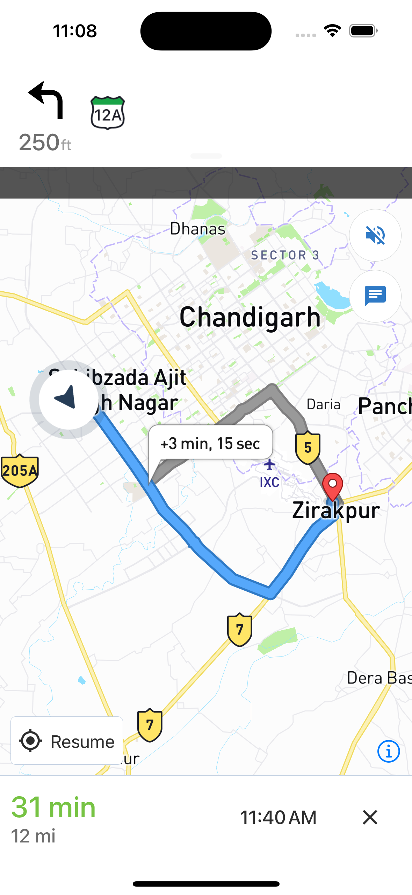
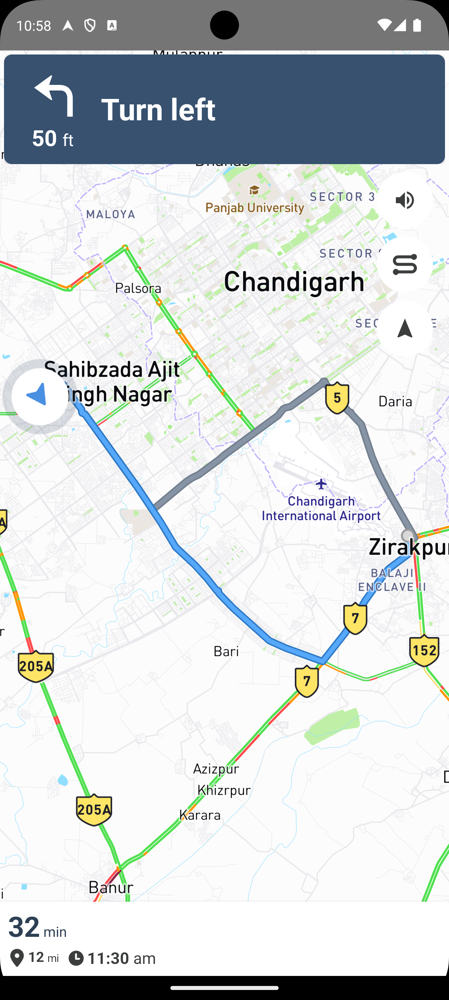
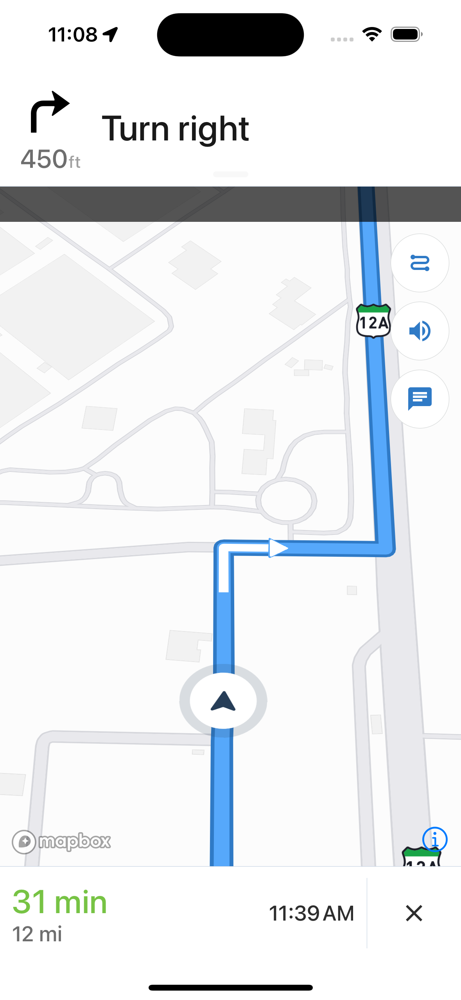
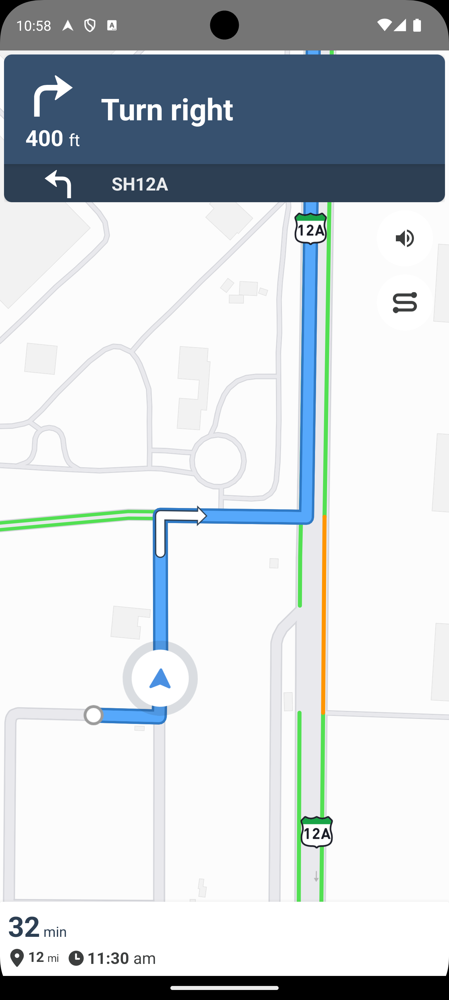

# @pawan-pk/react-native-mapbox-navigation <br/>[](https://www.npmjs.com/package/@pawan-pk/react-native-mapbox-navigation) [](https://github.com/pawan-pk/react-native-mapbox-navigation/actions) [](https://www.npmjs.com/package/@pawan-pk/react-native-mapbox-navigation)

Mapbox React Native SDKs enable interactive maps and real-time, traffic-aware turn-by-turn navigation, dynamically adjusting routes to avoid congestion.

🆕&nbsp; Uses Mapbox navigation v3 SDK<br>
📱&nbsp; Supports iOS, Android<br>
🌍&nbsp; Various languages<br>
🎨&nbsp; Customizable<br>
⛕&nbsp; Multiple Waypoints<br>
🚘&nbsp; iOS CarPlay Support

<a href="https://www.buymeacoffee.com/pawan_kumar" target="_blank"></a>

> [!IMPORTANT]
> ## Resupply fork — Mapbox Navigation SDK v3 (vendored binaries)
>
> This fork (`stefanpavlovic-tech/react-native-mapbox-navigation`) replaces the upstream
> iOS integration with **Mapbox Navigation SDK v3 via vendored binary xcframeworks** and
> brings Android to the matching SDK version. The upstream installation instructions below
> do **not** apply to the iOS side of this fork. Differences:
>
> - **iOS — Nav SDK 3.20.1 as vendored binaries.** v3 has no CocoaPods pod, and consuming
>   the SPM package from a CocoaPods host hits duplicate-symbol walls. Mapbox publishes
>   prebuilt binary xcframeworks (`mapbox-navigation-ios-build-artifacts`); the podspec
>   vendors them from `ios/Frameworks/` (gitignored — Mapbox's terms forbid redistribution).
>   **The consuming app must download them before `pod install`** — see
>   `scripts/fetch-mapbox-nav-binaries.sh` in the Resupply driver app (checksum-pinned,
>   wired into `postinstall`; auth via a Mapbox `DOWNLOADS:READ` token in `~/.netrc` or
>   `MAPBOX_DOWNLOADS_TOKEN`).
> - **Shared MapboxMaps.** The podspec depends on the CocoaPods `MapboxMaps` pod
>   (`11.20.2` — what Nav 3.20.1 pins), deduped by name with `@rnmapbox/maps`. No
>   `use_frameworks!` required.
> - **Android — `com.mapbox.navigationcore` 3.20.1**, with `-ndk27` artifacts when
>   `targetSdk >= 35` (matches `@rnmapbox/maps`' selection; mixing ndk27/non-ndk27 Mapbox
>   artifacts duplicates classes). Requires the token-gated Mapbox maven repo
>   (`MAPBOX_DOWNLOADS_TOKEN` gradle property).
> - **New Architecture fixes**: events are declared inside the codegen spec (they were
>   cast-only upstream, so Fabric registered none and every callback was dropped); Android
>   navigation starts after the full prop transaction (`onAfterUpdateTransaction`), not from
>   a prop setter racing alphabetical prop order.
> - **New `theme` prop**: `'day' | 'night' | 'auto'` — pins the day/night style and follows
>   live prop changes (iOS `StyleManager`, Android `NAVIGATION_DAY/NIGHT_STYLE`).
> - Version interlock when bumping the Nav SDK: lift the versions + checksums from the
>   matching `mapbox-navigation-ios-build-artifacts` tag and keep MapboxMaps aligned with
>   `@rnmapbox/maps`.

## Route View

<table>
   <tr>
  <td></td>
        <td>
    </td>
  </tr>
      <tr>
  <td align="center">iOS</td><td align="center">Android</td>
  </tr>
  </table>

## Turn by turn Navigation View

<table>
   <tr>
  <td></td>
        <td>
    </td>
  </tr>
      <tr>
  <td align="center">iOS</td><td align="center">Android</td>
  </tr>
  </table>

## Installation

### 1. Download package

```sh
# yarn
yarn add @pawan-pk/react-native-mapbox-navigation

# npm
npm install @pawan-pk/react-native-mapbox-navigation
```

## iOS Specific Instructions

1. Place your secret token in a .netrc file in your OS root directory.

   ```
   machine api.mapbox.com
   login mapbox
   password <INSERT SECRET TOKEN>
   ```

2. Install pods

   ```
   cd ios && pod install
   ```

3. Place your public token in your Xcode project's `Info.plist` and add a `MBXAccessToken` key whose value is your public access token.

4. Add the `UIBackgroundModes` key to `Info.plist` with `audio` and `location` if it is not already present. This will allow your app to deliver audible instructions while it is in the background or the device is locked.

   ```
   <key>UIBackgroundModes</key>
   <array>
     <string>audio</string>
     <string>location</string>
   </array>
   ```

## Android Specific Instructions

1. Place your secret token in your android app's top level `gradle.properties` or `«USER_HOME»/.gradle/gradle.properties` file

   ```
   MAPBOX_DOWNLOADS_TOKEN=<YOUR_MAPBOX_DOWNLOADS_TOKEN>
   ```

2. Open up your _project-level_ `build.gradle` file. Declare the Mapbox Downloads API's `releases/maven` endpoint in the _allprojects_ `repositories` block.

   ```gradle
   allprojects {
       repositories {
           maven {
                 url 'https://api.mapbox.com/downloads/v2/releases/maven'
                 authentication {
                     basic(BasicAuthentication)
                 }
                 credentials {
                   // Do not change the username below.
                   // This should always be `mapbox` (not your username).
                     username = "mapbox"
                     // Use the secret token you stored in gradle.properties as the password
                     password = project.properties['MAPBOX_DOWNLOADS_TOKEN'] ?: ""
                 }
             }
       }
   }
   ```

3. Add Resources<br/>
   To do so create a new string resource file in your app module `(e.g. app/src/main/res/values/mapbox_access_token.xml)` with your public Mapbox API token:

   ```xml
   <?xml version="1.0" encoding="utf-8"?>
    <resources xmlns:tools="http://schemas.android.com/tools">
        <string name="mapbox_access_token" translatable="false" tools:ignore="UnusedResources">YOUR_MAPBOX_ACCESS_TOKEN</string>
    </resources>
   ```

   For more details installation you can read the [Official docs of Mapbox](https://docs.mapbox.com/android/navigation/guides/installation).

## Usage

```js
import MapboxNavigation from '@pawan-pk/react-native-mapbox-navigation';
import { StyleSheet } from 'react-native';

export default function App() {
  return (
    <MapboxNavigation
      startOrigin={{ latitude: 30.699239, longitude: 76.6905161 }}
      destination={{ latitude: 30.6590196, longitude: 76.8185852 }}
      waypoints={[
        { latitude: 30.726848, longitude: 76.733758 },
        { latitude: 30.738819, longitude: 76.757902 },
      ]}
      style={styles.container}
      shouldSimulateRoute={false}
      showCancelButton={false}
      language="en"
    />
  );
}

const styles = StyleSheet.create({
  container: {
    flex: 1,
  },
});
```

## `MapboxNavigation` Props

- `startOrigin(Required)` (object): The starting point of the navigation. Should contain latitude and longitude keys.

- `destination(Required)` (object): The destination point of the navigation. Should contain latitude and longitude keys.

- `waypoints` (array): The waypoints for navigation points between startOrigin and destination. Should contains array of latitude and longitude keys.

- `style` (StyleObject): Custom styles for the navigation mapview.

- `shouldSimulateRoute` (boolean): [iOS Only] If true, simulates the route for testing purposes. Defaults to `false`.

- `showCancelButton` (boolean): [Android Only] If true, shows a cancel button on the navigation screen. Defaults to `false`.

- `language` (string): The language for the navigation instructions. Defaults to `en`.

- `distanceUnit` ('metric' | 'imperial'): Unit of direction and voice instructions (default is 'imperial')

- `onLocationChange`: Function that is called frequently during route navigation. It receives `latitude`, `longitude`, `heading` and `accuracy` as parameters that represent the current location during navigation.

- `onRouteProgressChange`: Function that is called frequently during route navigation. It receives `distanceTraveled`, `durationRemaining`, `fractionTraveled`, and `distanceRemaining` as parameters.

- `onError`: Function that is called whenever an error occurs. It receives a `message` parameter that describes the error that occurred.

- `onCancelNavigation`: Function that is called whenever a user cancels navigation.

- `onArrive`: Function that is called when you arrive at the provided destination.

- `travelMode` ('driving' | 'driving-traffic' | 'walking' | 'cycling'): Specifies the mode of travel to be used for navigation (default is 'driving-traffic'):
  - 'driving': Standard automobile navigation that does not take live traffic conditions into account.
  - 'driving-traffic': Automobile navigation that considers current traffic conditions to avoid congestion.
  - 'walking': Navigation for pedestrians.
  - 'cycling': Navigation optimized for cyclists.

### Resupply fork additions

Props added by this fork (not present upstream):

- `theme` ('day' | 'night' | 'auto'): Map/UI style. `'day'` and `'night'` force the corresponding style and follow live prop changes; `'auto'` (default) lets the SDK decide — on iOS it switches with time of day, on Android it uses the day style.

- `styleUrl` (string): App Mapbox style URI (e.g. `"mapbox://styles/mapbox/light-v11"`) so the nav map matches the app's other maps. Omitted = the SDK navigation style. Pass the URI matching the current color scheme (paired with `theme`).

- `fontFamily` (string): [iOS Only] Font family (PostScript family name, e.g. `"Rubik"`) for the nav UI labels. The font must be registered in the host app. No-op on Android (the maneuver banner uses a build-time text appearance).

- `bottomInset` (number): Extra bottom camera inset (points on iOS / dp on Android) so the route and puck stay framed above an app overlay (e.g. a bottom sheet) covering the lower part of the nav view. Defaults to `0`.

- `showsReportFeedback` (boolean): [iOS Only] Whether the SDK's report-issue / feedback floating button is shown. Hiding it keeps the overview, recenter and mute buttons. Defaults to the SDK default (shown).

#### Truck routing

These constrain routing to roads your vehicle can use (avoiding low bridges, narrow roads, and weight-restricted roads where Mapbox has the data). Mapbox has no dedicated truck profile — these are vehicle-dimension parameters applied to the `driving` / `driving-traffic` profiles. Each is best-effort: coverage of road restriction data varies by region. When omitted or `0`, the API's car-sized defaults apply, so existing callers are unaffected.

- `vehicleMaxHeight` (number): Max vehicle height in **meters**. Restricts the route to roads with a height limit ≥ this value (`max_height`). Default when unset: 1.6 m.

- `vehicleMaxWidth` (number): Max vehicle width in **meters**. Restricts the route to roads with a width limit ≥ this value (`max_width`). Default when unset: 1.9 m.

- `vehicleMaxWeight` (number): Max vehicle weight in **metric tons** (1000 kg). Restricts the route to roads with a weight limit ≥ this value (`max_weight`). Default when unset: 2.5 metric tons.

## Contributing

See the [contributing guide](CONTRIBUTING.md) to learn how to contribute to the repository and the development workflow.

## License

MIT

---

Made with [create-react-native-library](https://github.com/callstack/react-native-builder-bob)
